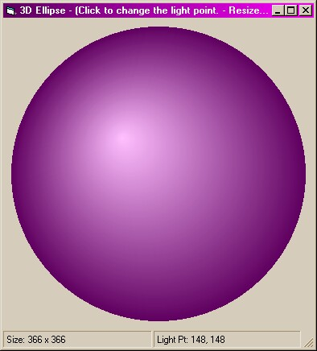



## Ellipse3D

### Description

A tiny bas module is all you need to draw 3D ellipses. Just give it any rectangle, colors and point of light and it will draw the ellipse quickly and smoothly. The zip includes one form (for demo purposes) and the Ellipse3D.bas module. A MUST SEE for graphics beginners and pros.
 
### More Info
 
Source code is well documented.

             |
---                |---
**Submitted On**   |2000-06-03 12:25:52
**By**             |[Rocky Clark \(Kath\-Rock Software\)](https://github.com/Planet-Source-Code/PSCIndex/blob/master/ByAuthor/rocky-clark-kath-rock-software.md)
**Level**          |Beginner
**User Rating**    |5.0 (25 globes from 5 users)
**Compatibility**  |VB 5\.0, VB 6\.0
**Category**       |[Miscellaneous](https://github.com/Planet-Source-Code/PSCIndex/blob/master/ByCategory/miscellaneous__1-1.md)
**World**          |[Visual Basic](https://github.com/Planet-Source-Code/PSCIndex/blob/master/ByWorld/visual-basic.md)
**Archive File**   |[CODE\_UPLOAD6394632000\.zip](https://github.com/Planet-Source-Code/rocky-clark-kath-rock-software-ellipse3d__1-8576/archive/master.zip)

